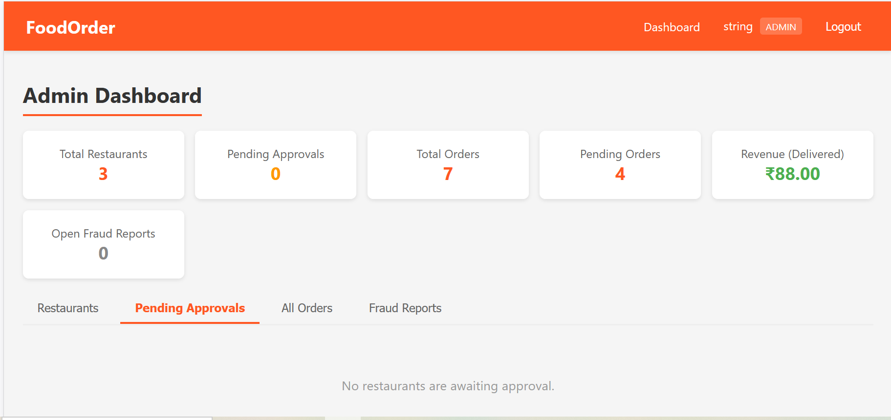
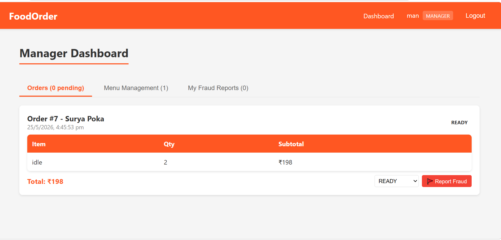
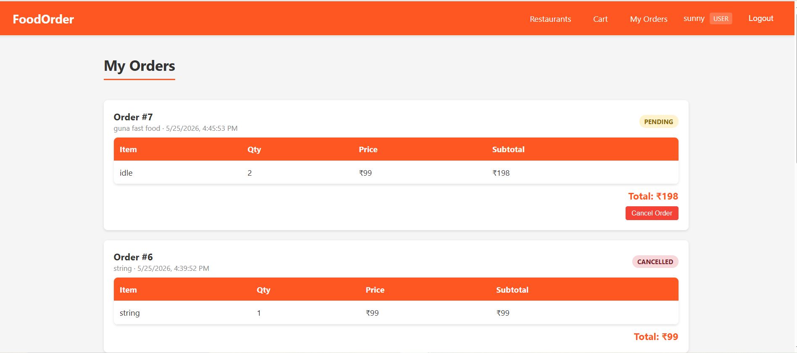
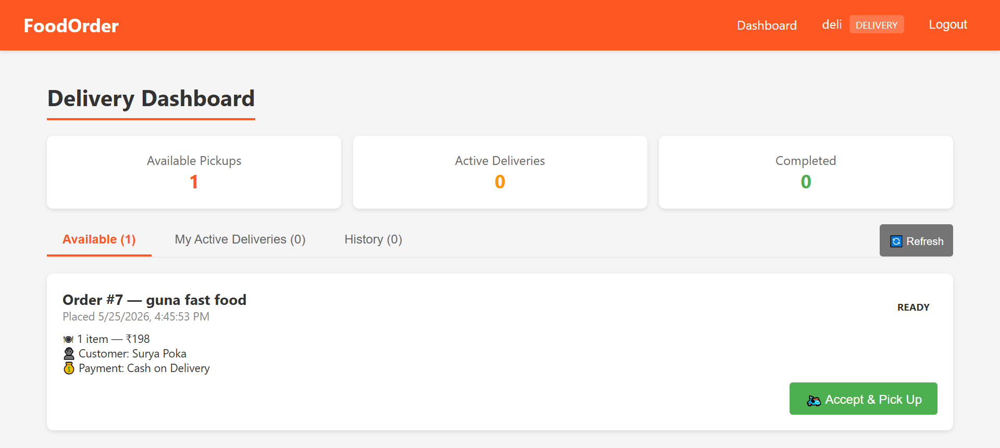

Admin dashboard


manager dashboard



Custamor Dashboard



delivary man Dashboard



# Food Ordering System - Full Stack

A full-stack food ordering application built with **Spring Boot 3 + React 18 + JWT** on **Java 21**.

## Roles

- **ADMIN**: Manage all restaurants (add/edit/remove). View all orders across the system.
- **MANAGER**: Manage menu items (add/edit/remove) for their assigned restaurant. Accept/reject orders and update order status (Preparing, Out for Delivery, Delivered).
- **USER**: Browse restaurants, view menus, add items to cart, place orders, view order history, cancel pending orders.

## Tech Stack

- **Backend**: Spring Boot 3.3, Spring Security, Spring Data JPA, JWT (jjwt 0.12.x), Bean Validation, SpringDoc OpenAPI 2.6
- **Frontend**: React 18, React Router, Axios, Context API
- **Database**: H2 (in-memory, default) or MySQL
- **Build**: Maven + npm
- **Java**: 21 (LTS)

## Project Structure

```
food-ordering-system/
|-- backend/                  Spring Boot REST API
|   |-- pom.xml
|   `-- src/main/
|       |-- java/com/foodorder/
|       |   |-- config/       Security, CORS, OpenAPI, seeder, async
|       |   |-- controller/   REST endpoints
|       |   |-- dto/          Request/response DTOs
|       |   |-- entity/       JPA entities (User, Restaurant, MenuItem, Cart, CartItem, Order, OrderItem)
|       |   |-- enums/        Role, OrderStatus (separated from entities)
|       |   |-- exception/    Custom and global exception handler
|       |   |-- repository/   JPA repositories
|       |   |-- security/     JWT utils, filter, UserDetails
|       |   `-- service/      Business logic
|       `-- resources/application.properties
|-- frontend/                 React app
|   |-- package.json
|   |-- public/index.html
|   `-- src/
|       |-- App.js, index.js, index.css
|       |-- components/       Navbar, ProtectedRoute
|       |-- context/          AuthContext, CartContext
|       |-- pages/            Login, Register, Restaurants, Menu, Cart, MyOrders, ManagerDashboard, AdminDashboard
|       `-- services/api.js   Axios with JWT interceptors
`-- database/schema.sql       MySQL schema reference
```

## Quick Start

### Backend

```bash
cd backend
mvn spring-boot:run
```

- Backend runs at: `http://localhost:8081/api`
- H2 Console: `http://localhost:8081/api/h2-console`
  (JDBC URL: `jdbc:h2:mem:foodorderdb`, user: `sa`, no password)
- Swagger UI: `http://localhost:8081/api/swagger-ui.html`
- OpenAPI JSON: `http://localhost:8081/api/v3/api-docs`

### Frontend

```bash
cd frontend
npm install
npm start
```

Frontend runs at `http://localhost:3000`.

## Default Accounts (auto-seeded)

| Role     | Username   | Password    | Notes                           |
|----------|------------|-------------|---------------------------------|
| ADMIN    | admin      | admin123    | Full system access              |
| MANAGER  | manager1   | manager123  | Manages Pizza Palace            |
| MANAGER  | manager2   | manager123  | Manages Burger Hub              |
| MANAGER  | manager3   | manager123  | Manages Spice Garden            |
| USER     | john       | john123     | Customer with sample address    |

Three sample restaurants with menus are also seeded.

## Using Swagger UI

1. Open `http://localhost:8081/api/swagger-ui.html`
2. Expand the **Authentication** section, click `POST /auth/login`, click "Try it out"
3. Use one of the seeded credentials, send the request, copy the `token` value from the response
4. Click the green **Authorize** button at the top right
5. Paste only the token (do not include the word Bearer); click Authorize then Close
6. All secured endpoints are now usable from the UI

## Switching to MySQL

Edit `backend/src/main/resources/application.properties`:

1. Comment out the H2 block
2. Uncomment the MySQL block
3. Update credentials. The database `foodorderdb` is auto-created

## REST API Endpoints

### Auth (public)
- `POST /api/auth/register` - Register (USER by default; pass `role` and `restaurantId` for MANAGER)
- `POST /api/auth/login` - Login, returns JWT

### Restaurants
- `GET /api/restaurants` - List active (public)
- `GET /api/restaurants/{id}` - Detail (public)
- `GET /api/restaurants/{id}/menu` - Menu (public)
- `GET /api/restaurants/all` - All including inactive (ADMIN)
- `POST /api/restaurants` (ADMIN)
- `PUT /api/restaurants/{id}` (ADMIN)
- `DELETE /api/restaurants/{id}` (ADMIN)

### Menu Items
- `GET /api/menu-items/restaurant/{rid}` (MANAGER/ADMIN)
- `POST /api/menu-items/restaurant/{rid}` (MANAGER/ADMIN)
- `PUT /api/menu-items/{id}` (MANAGER/ADMIN)
- `DELETE /api/menu-items/{id}` (MANAGER/ADMIN)

### Cart (USER only)
- `GET /api/cart` - Get the current user's cart
- `POST /api/cart/items` - Add an item to the cart (auto clears if from a different restaurant)
- `PUT /api/cart/items/{cartItemId}` - Update item quantity
- `DELETE /api/cart/items/{cartItemId}` - Remove a single item
- `DELETE /api/cart` - Empty the cart

### Orders
- `POST /api/orders` - Place order (USER; reads from persistent cart if items not supplied)
- `GET /api/orders/my-orders` - User's own orders (USER)
- `POST /api/orders/{id}/cancel` - Cancel PENDING order (USER)
- `GET /api/orders/restaurant` - Manager's restaurant orders (MANAGER)
- `PUT /api/orders/{id}/status` - Update status (MANAGER/ADMIN)
- `GET /api/orders/all` - All orders (ADMIN)
- `GET /api/orders/{id}` - Single order (any authenticated user)

## Cart Persistence

Carts are persisted server-side in dedicated `carts` and `cart_items` tables. Each user has exactly one cart, tied to one restaurant at a time. Adding an item from a different restaurant automatically clears the existing cart. The cart is cleared after a successful order placement.

This means the cart survives logout/login and is accessible across devices for the same user.

## Email Setup (optional)

To enable real email sending, edit `application.properties`:

```properties
spring.mail.username=your-email@gmail.com
spring.mail.password=your-app-password
app.mail.enabled=true
```

Use a Gmail App Password (not your account password). By default emails are logged to console.

## Build for Production

```bash
# Backend JAR
cd backend && mvn clean package
java -jar target/food-ordering-system-1.0.0.jar

# Frontend build
cd frontend && npm run build
# Outputs static files to frontend/build/
```

## Java Version Note

This project targets **Java 21 (LTS)**. Ensure your `JAVA_HOME` points to a JDK 21 installation. You can verify with:

```bash
java -version
mvn -version
```

## License

Educational use for hackathon project.


